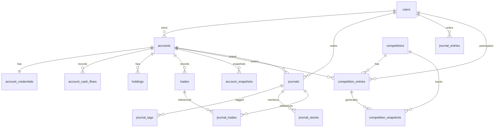

# 데이터베이스 현황 명세서 (db.md)

> **최종 업데이트:** 2026-06-20  
> **상태:** 구현 완료 · 마이그레이션 010까지 적용됨

---

## 1. 개요

| 항목 | 값 |
|------|-----|
| DBMS | SQLite 3 (WAL 모드) |
| 위치 | `/var/www/bullslong/backend/data/bullslong.db` |
| 현재 마이그레이션 | `010_competition_multi_account` (head) |
| 테이블 수 | **14개** |
| ORM | SQLAlchemy 2.0 (Mapped / mapped_column) |
| 마이그레이션 | Alembic 1.18.4 |

### 설계 원칙
- 금액: `NUMERIC(18, 2)`, 수익률: `NUMERIC(10, 4)`
- 시각: UTC 저장, API 응답 ISO 8601
- 삭제: Hard delete (CASCADE), 단 accounts.account_id → SET NULL (journal)
- FK ON DELETE: 명시적 정책 (`CASCADE` / `RESTRICT` / `SET NULL`)

---

## 2. ER 다이어그램



---

## 3. 마이그레이션 이력

| 파일 | 내용 |
|------|------|
| `001_initial_schema.py` | users, accounts, holdings, trades, account_snapshots, journals, journal_tags, journal_stocks, journal_trades, competitions, competition_entries, competition_snapshots |
| `002_account_broker_credentials.py` | account_credentials 추가 (KIS API 키 암호화 저장) |
| `003_holdings_market_type.py` | holdings.market_type 컬럼 추가 (domestic/us) |
| `004_holdings_broker_fields.py` | holdings.exchange_code, orderable_quantity, currency 추가 |
| `005_holdings_pnl_fields.py` | holdings.purchase_amount, evaluation_amount, profit_loss, return_rate 추가 |
| `006_journal_entries.py` | journal_entries 테이블 추가 (차트 마커용) |
| `007_journal_entry_side.py` | journal_entries.side 컬럼 추가 (buy/sell) |
| `008_account_snapshot_evaluation.py` | account_snapshots.evaluation_amount 추가 |
| `009_competition_total_value.py` | competition_entries.period_deposits, period_withdrawals 추가 |
| `010_competition_multi_account.py` | account_cash_flows 테이블 추가 (입출금 보정) |

---

## 4. 테이블 상세

### 4.1 users

| 컬럼 | 타입 | NULL | 기본값 | 설명 |
|------|------|------|--------|------|
| id | INTEGER | NO | PK | |
| nickname | VARCHAR(20) | NO | | UNIQUE |
| email | VARCHAR(255) | NO | | UNIQUE, INDEX |
| password_hash | VARCHAR(255) | NO | | bcrypt |
| role | VARCHAR(20) | NO | `user` | `user` \| `admin` |
| show_nickname_public | BOOLEAN | NO | TRUE | 리더보드 닉네임 공개 |
| created_at | DATETIME | NO | | UTC |
| updated_at | DATETIME | NO | | UTC, onupdate |

---

### 4.2 accounts

| 컬럼 | 타입 | NULL | 기본값 | 설명 |
|------|------|------|--------|------|
| id | INTEGER | NO | PK | |
| user_id | INTEGER | NO | FK→users | CASCADE |
| name | VARCHAR(50) | NO | | 계좌 별칭 |
| broker | VARCHAR(50) | NO | | 증권사명 표시용 |
| initial_capital | NUMERIC(18,2) | NO | | 초기 투입 자본 |
| cash_balance | NUMERIC(18,2) | NO | 0 | 현금 잔고 |
| description | TEXT | YES | | |
| broker_code | VARCHAR(20) | NO | `manual` | `manual` \| `kis` 등 |
| account_number | VARCHAR(20) | YES | | API 연동 시 계좌번호 |
| connection_mode | VARCHAR(20) | NO | `manual` | `manual` \| `api` |
| sync_status | VARCHAR(20) | NO | `manual` | `manual` \| `ok` \| `error` |
| last_synced_at | DATETIME | YES | | 마지막 동기화 시각 |
| last_sync_error | TEXT | YES | | 동기화 오류 메시지 |
| created_at | DATETIME | NO | | |
| updated_at | DATETIME | NO | | |

**INDEX:** `idx_accounts_user_id (user_id)`

---

### 4.3 account_credentials

KIS API 키를 Fernet 암호화하여 저장 (accounts와 1:1)

| 컬럼 | 타입 | NULL | 설명 |
|------|------|------|------|
| id | INTEGER | NO | PK |
| account_id | INTEGER | NO | FK→accounts (UNIQUE, CASCADE) |
| app_key_encrypted | TEXT | NO | Fernet 암호화 |
| app_secret_encrypted | TEXT | NO | Fernet 암호화 |
| access_token_encrypted | TEXT | YES | 발급된 KIS 액세스 토큰 |
| token_expires_at | DATETIME | YES | 토큰 만료 시각 |
| extra_json | TEXT | YES | 기타 설정 (JSON) |

---

### 4.4 account_cash_flows

대회 기간 중 입출금 기록 (수익률 보정용)

| 컬럼 | 타입 | NULL | 설명 |
|------|------|------|------|
| id | INTEGER | NO | PK |
| account_id | INTEGER | NO | FK→accounts (CASCADE) |
| flow_date | DATE | NO | 입출금 날짜 |
| flow_type | VARCHAR(10) | NO | `deposit` \| `withdraw` |
| amount | NUMERIC(18,2) | NO | |
| memo | TEXT | YES | |
| created_at | DATETIME | NO | |

**INDEX:** `idx_cash_flows_account_date (account_id, flow_date)`

---

### 4.5 holdings

| 컬럼 | 타입 | NULL | 기본값 | 설명 |
|------|------|------|--------|------|
| id | INTEGER | NO | PK | |
| account_id | INTEGER | NO | FK→accounts (CASCADE) | |
| market_type | VARCHAR(10) | NO | `domestic` | `domestic` \| `us` |
| exchange_code | VARCHAR(10) | YES | | NASD, NYSE, AMEX 등 |
| stock_code | VARCHAR(12) | NO | | |
| stock_name | VARCHAR(100) | NO | | |
| quantity | INTEGER | NO | 0 | |
| orderable_quantity | INTEGER | YES | | KIS 주문 가능 수량 |
| avg_price | NUMERIC(18,2) | NO | | 평균 매입단가 |
| current_price | NUMERIC(18,2) | NO | | |
| purchase_amount | NUMERIC(18,2) | YES | | 매입금액 |
| evaluation_amount | NUMERIC(18,2) | YES | | 평가금액 |
| profit_loss | NUMERIC(18,4) | YES | | 평가손익 |
| return_rate | NUMERIC(12,4) | YES | | 수익률 |
| currency | VARCHAR(3) | YES | | KRW, USD 등 |
| updated_at | DATETIME | NO | | |

**UNIQUE:** `(account_id, market_type, stock_code)`  
**INDEX:** `idx_holdings_account_id`

---

### 4.6 trades

| 컬럼 | 타입 | NULL | 설명 |
|------|------|------|------|
| id | INTEGER | NO | PK |
| account_id | INTEGER | NO | FK→accounts (CASCADE) |
| stock_code | VARCHAR(6) | NO | |
| stock_name | VARCHAR(100) | NO | |
| trade_type | VARCHAR(4) | NO | `buy` \| `sell` |
| quantity | INTEGER | NO | |
| price | NUMERIC(18,2) | NO | 체결 단가 |
| fee | NUMERIC(18,2) | NO | 수수료 (기본 0) |
| tax | NUMERIC(18,2) | NO | 세금 (기본 0) |
| realized_pnl | NUMERIC(18,2) | YES | 매도 시 실현손익 |
| traded_at | DATETIME | NO | 체결 일시 |
| memo | TEXT | YES | |
| created_at | DATETIME | NO | |

**INDEX:** `(account_id)`, `(traded_at)`, `(stock_code)`, `(account_id, traded_at)`

---

### 4.7 account_snapshots

| 컬럼 | 타입 | NULL | 설명 |
|------|------|------|------|
| id | INTEGER | NO | PK |
| account_id | INTEGER | NO | FK→accounts (CASCADE) |
| snapshot_date | DATE | NO | |
| total_value | NUMERIC(18,2) | NO | 총 평가금액 |
| return_rate | NUMERIC(10,4) | NO | 수익률 |
| cash_balance | NUMERIC(18,2) | NO | |
| evaluation_amount | NUMERIC(18,2) | YES | 주식 평가금액 |
| created_at | DATETIME | NO | |

**UNIQUE:** `(account_id, snapshot_date)`  
**INDEX:** `(account_id, snapshot_date)`

---

### 4.8 journals

| 컬럼 | 타입 | NULL | 설명 |
|------|------|------|------|
| id | INTEGER | NO | PK |
| user_id | INTEGER | NO | FK→users (CASCADE) |
| account_id | INTEGER | YES | FK→accounts (SET NULL) |
| title | VARCHAR(100) | NO | |
| journal_date | DATE | NO | |
| content | TEXT | NO | Markdown 본문 |
| reflection | TEXT | YES | 반성·교훈 |
| emotion | VARCHAR(20) | YES | 감정 태그 |
| created_at | DATETIME | NO | |
| updated_at | DATETIME | NO | |

**emotion 값:** `confident`, `anxious`, `fomo`, `calm`, `greedy`, `fearful`

---

### 4.9 journal_tags

| 컬럼 | 타입 | NULL |
|------|------|------|
| id | INTEGER | NO |
| journal_id | INTEGER | FK→journals (CASCADE) |
| tag | VARCHAR(30) | NO |

---

### 4.10 journal_stocks

| 컬럼 | 타입 | NULL |
|------|------|------|
| id | INTEGER | NO |
| journal_id | INTEGER | FK→journals (CASCADE) |
| stock_code | VARCHAR(6) | NO |
| stock_name | VARCHAR(100) | YES |

---

### 4.11 journal_trades (M:N)

| 컬럼 | 타입 | 설명 |
|------|------|------|
| journal_id | INTEGER | PK, FK→journals (CASCADE) |
| trade_id | INTEGER | PK, FK→trades (CASCADE) |

---

### 4.12 journal_entries

차트 마커용 — 날짜·종목·매매 사유를 간단하게 기록

| 컬럼 | 타입 | NULL | 설명 |
|------|------|------|------|
| id | INTEGER | NO | PK |
| user_id | INTEGER | NO | FK→users (CASCADE) |
| journal_date | DATE | NO | |
| stock_code | VARCHAR(12) | NO | |
| stock_name | VARCHAR(100) | NO | |
| side | VARCHAR(4) | NO | `buy` \| `sell` |
| reason | TEXT | NO | 매매 사유 |
| created_at | DATETIME | NO | |
| updated_at | DATETIME | NO | |

**INDEX:** `(user_id)`, `(journal_date)`, `(stock_code)`

---

### 4.13 competitions

| 컬럼 | 타입 | NULL | 설명 |
|------|------|------|------|
| id | INTEGER | NO | PK |
| name | VARCHAR(100) | NO | |
| description | TEXT | YES | |
| start_date | DATE | NO | |
| end_date | DATE | NO | |
| status | VARCHAR(20) | NO | `upcoming` \| `active` \| `ended` |
| min_initial_capital | NUMERIC(18,2) | YES | |
| max_participants | INTEGER | YES | NULL=무제한 |
| rules | TEXT | YES | |
| created_at | DATETIME | NO | |
| updated_at | DATETIME | NO | |

**INDEX:** `(status)`, `(start_date, end_date)`

---

### 4.14 competition_entries

| 컬럼 | 타입 | NULL | 설명 |
|------|------|------|------|
| id | INTEGER | NO | PK |
| competition_id | INTEGER | NO | FK→competitions (CASCADE) |
| user_id | INTEGER | NO | FK→users (CASCADE) |
| account_id | INTEGER | NO | FK→accounts (RESTRICT) |
| entry_value | NUMERIC(18,2) | NO | 참가 시점 평가금액 |
| current_value | NUMERIC(18,2) | NO | 현재 평가금액 |
| return_rate | NUMERIC(10,4) | NO | 현재 수익률 |
| period_deposits | NUMERIC(18,2) | NO | 대회 기간 중 입금 합계 |
| period_withdrawals | NUMERIC(18,2) | NO | 대회 기간 중 출금 합계 |
| final_rank | INTEGER | YES | 종료 후 확정 순위 |
| final_return_rate | NUMERIC(10,4) | YES | 종료 후 확정 수익률 |
| joined_at | DATETIME | NO | |
| updated_at | DATETIME | NO | |

**UNIQUE:** `(competition_id, account_id)` — 1계좌 1대회  
**INDEX:** `(competition_id, return_rate)` — 리더보드

---

### 4.15 competition_snapshots

| 컬럼 | 타입 | NULL |
|------|------|------|
| id | INTEGER | NO |
| competition_id | INTEGER | FK→competitions (CASCADE) |
| entry_id | INTEGER | FK→competition_entries (CASCADE) |
| snapshot_date | DATE | NO |
| return_rate | NUMERIC(10,4) | NO |
| total_value | NUMERIC(18,2) | NO |

**UNIQUE:** `(entry_id, snapshot_date)`  
**INDEX:** `(competition_id, snapshot_date)`

---

## 5. 테이블 목록 요약

| # | 테이블 | 설명 |
|---|--------|------|
| 1 | `users` | 사용자 |
| 2 | `accounts` | 주식 계좌 |
| 3 | `account_credentials` | KIS API 키 (암호화) |
| 4 | `account_cash_flows` | 계좌 입출금 |
| 5 | `holdings` | 보유종목 |
| 6 | `trades` | 매매내역 |
| 7 | `account_snapshots` | 계좌 일별 스냅샷 |
| 8 | `journals` | 매매일지 |
| 9 | `journal_tags` | 일지 태그 |
| 10 | `journal_stocks` | 일지 관련 종목 |
| 11 | `journal_trades` | 일지-매매 연결 (M:N) |
| 12 | `journal_entries` | 차트 마커용 매매 항목 |
| 13 | `competitions` | 경연 대회 |
| 14 | `competition_entries` | 대회 참가 |
| 15 | `competition_snapshots` | 대회 일별 수익률 |

> `competition_snapshots`까지 포함하면 **15개**, 4.15 항목 참고

---

## 6. 주요 쿼리 패턴

### 6.1 계좌 현재 평가금액
```sql
SELECT
  a.id,
  a.cash_balance,
  COALESCE(SUM(h.quantity * h.current_price), 0)           AS holdings_value,
  a.cash_balance + COALESCE(SUM(h.quantity * h.current_price), 0) AS total_value,
  (a.cash_balance + COALESCE(SUM(h.quantity * h.current_price), 0)
    - a.initial_capital) / a.initial_capital * 100         AS return_rate
FROM accounts a
LEFT JOIN holdings h ON h.account_id = a.id
WHERE a.id = :account_id
GROUP BY a.id;
```

### 6.2 리더보드
```sql
SELECT
  ce.id, u.nickname, a.name AS account_name,
  ce.return_rate, ce.current_value, ce.entry_value,
  RANK() OVER (ORDER BY ce.return_rate DESC) AS rank
FROM competition_entries ce
JOIN users u ON u.id = ce.user_id
JOIN accounts a ON a.id = ce.account_id
WHERE ce.competition_id = :cid
  AND u.show_nickname_public = TRUE
ORDER BY ce.return_rate DESC;
```

---

## 7. 운영 유지보수

```bash
# 마이그레이션 상태 확인
cd /var/www/bullslong/backend
venv/bin/alembic current
venv/bin/alembic history --verbose

# 마이그레이션 적용
venv/bin/alembic upgrade head

# DB 백업
cp data/bullslong.db data/bullslong_$(date +%Y%m%d).db
```

WAL 모드: `SQLITE_WAL=true` 환경 변수로 자동 설정됨
