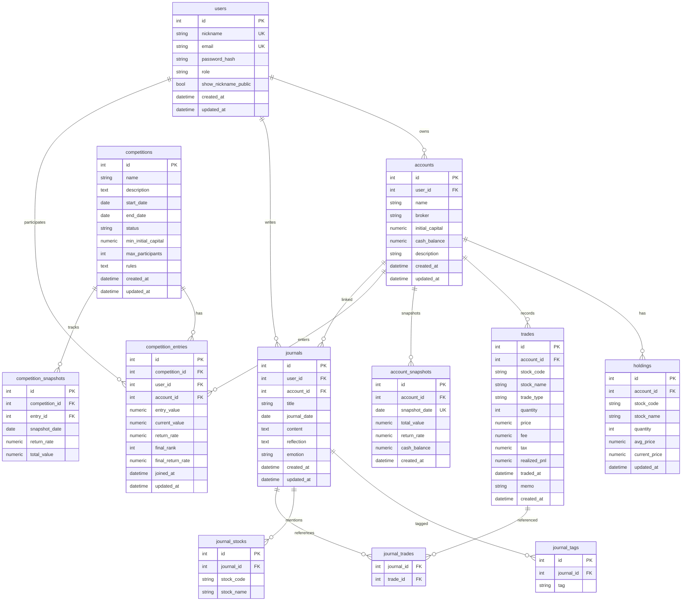

# 데이터베이스 설계 명세서 (db.md)

## 1. 개요

### 1.1 DBMS
- **개발·프로덕션:** SQLite 3 (`backend.md`와 동일 — PostgreSQL 전환은 Out of Scope)

### 1.2 설계 원칙
- 모든 금액: `NUMERIC(18, 2)` 또는 SQLite `REAL` (서비스 레이어에서 반올림)
- 모든 시각: UTC 저장, API 응답 ISO 8601
- Soft delete: MVP는 Hard delete, `deleted_at` 컬럼은 Phase 2
- FK: ON DELETE 정책 명시
- 인덱스: 조회·조인·정렬 빈번 컬럼

### 1.3 네이밍 규칙
- 테이블: snake_case, 복수형 (`users`, `accounts`)
- PK: `id` (INTEGER AUTOINCREMENT)
- FK: `{table_singular}_id`
- 타임스탬프: `created_at`, `updated_at`

---

## 2. ER 다이어그램



---

## 3. 테이블 상세 정의

### 3.1 users — 사용자

| 컬럼 | 타입 | NULL | 기본값 | 설명 |
|------|------|------|--------|------|
| id | INTEGER | NO | PK | |
| nickname | VARCHAR(20) | NO | | UNIQUE, 표시명 |
| email | VARCHAR(255) | NO | | UNIQUE, 로그인 ID |
| password_hash | VARCHAR(255) | NO | | bcrypt |
| role | VARCHAR(20) | NO | `'user'` | `user`, `admin` |
| show_nickname_public | BOOLEAN | NO | TRUE | 리더보드 노출 |
| created_at | DATETIME | NO | now | |
| updated_at | DATETIME | NO | now | |

**인덱스**
- `UNIQUE (nickname)`
- `UNIQUE (email)`

---

### 3.2 accounts — 주식 계좌

| 컬럼 | 타입 | NULL | 기본값 | 설명 |
|------|------|------|--------|------|
| id | INTEGER | NO | PK | |
| user_id | INTEGER | NO | FK → users.id | |
| name | VARCHAR(50) | NO | | 계좌 별칭 |
| broker | VARCHAR(50) | NO | | 증권사명 |
| initial_capital | NUMERIC(18,2) | NO | | 초기 투입 자본 |
| cash_balance | NUMERIC(18,2) | NO | 0 | 현금 잔고 |
| description | TEXT | YES | | |
| created_at | DATETIME | NO | now | |
| updated_at | DATETIME | NO | now | |

**인덱스**
- `INDEX idx_accounts_user_id (user_id)`

**FK**
- `user_id` → `users(id)` ON DELETE CASCADE

**비고**
- `cash_balance`: initial_capital에서 매수·매도·수수료 반영
- 계좌 생성 시 `cash_balance = initial_capital`

---

### 3.3 holdings — 보유 종목

| 컬럼 | 타입 | NULL | 기본값 | 설명 |
|------|------|------|--------|------|
| id | INTEGER | NO | PK | |
| account_id | INTEGER | NO | FK → accounts.id | |
| stock_code | VARCHAR(6) | NO | | |
| stock_name | VARCHAR(100) | NO | | |
| quantity | INTEGER | NO | 0 | 보유 수량 |
| avg_price | NUMERIC(18,2) | NO | | 평균 매입단가 |
| current_price | NUMERIC(18,2) | NO | | 현재가 (수동) |
| updated_at | DATETIME | NO | now | |

**인덱스**
- `UNIQUE (account_id, stock_code)`
- `INDEX idx_holdings_account_id (account_id)`

**FK**
- `account_id` → `accounts(id)` ON DELETE CASCADE

---

### 3.4 trades — 매매 내역

| 컬럼 | 타입 | NULL | 기본값 | 설명 |
|------|------|------|--------|------|
| id | INTEGER | NO | PK | |
| account_id | INTEGER | NO | FK → accounts.id | |
| stock_code | VARCHAR(6) | NO | | |
| stock_name | VARCHAR(100) | NO | | |
| trade_type | VARCHAR(4) | NO | | `buy`, `sell` |
| quantity | INTEGER | NO | | |
| price | NUMERIC(18,2) | NO | | 체결 단가 |
| fee | NUMERIC(18,2) | NO | 0 | 수수료 |
| tax | NUMERIC(18,2) | NO | 0 | 세금 |
| realized_pnl | NUMERIC(18,2) | YES | | 매도 시 실현손익 |
| traded_at | DATETIME | NO | | 체결 일시 |
| memo | TEXT | YES | | |
| created_at | DATETIME | NO | now | |

**인덱스**
- `INDEX idx_trades_account_id (account_id)`
- `INDEX idx_trades_traded_at (traded_at)`
- `INDEX idx_trades_stock_code (stock_code)`
- `INDEX idx_trades_account_traded (account_id, traded_at DESC)`

**FK**
- `account_id` → `accounts(id)` ON DELETE CASCADE

**CHECK (애플리케이션 또는 DB)**
- `trade_type IN ('buy', 'sell')`
- `quantity > 0`
- `price > 0`

---

### 3.5 account_snapshots — 계좌 일별 스냅샷

| 컬럼 | 타입 | NULL | 기본값 | 설명 |
|------|------|------|--------|------|
| id | INTEGER | NO | PK | |
| account_id | INTEGER | NO | FK → accounts.id | |
| snapshot_date | DATE | NO | | |
| total_value | NUMERIC(18,2) | NO | | 총 평가금액 |
| return_rate | NUMERIC(10,4) | NO | | 수익률 % |
| cash_balance | NUMERIC(18,2) | NO | | |
| created_at | DATETIME | NO | now | |

**인덱스**
- `UNIQUE (account_id, snapshot_date)`
- `INDEX idx_snapshots_account_date (account_id, snapshot_date)`

**FK**
- `account_id` → `accounts(id)` ON DELETE CASCADE

---

### 3.6 journals — 매매일지

| 컬럼 | 타입 | NULL | 기본값 | 설명 |
|------|------|------|--------|------|
| id | INTEGER | NO | PK | |
| user_id | INTEGER | NO | FK → users.id | |
| account_id | INTEGER | YES | FK → accounts.id | 연결 계좌 (선택) |
| title | VARCHAR(100) | NO | | |
| journal_date | DATE | NO | | 작성 기준일 |
| content | TEXT | NO | | Markdown 본문 |
| reflection | TEXT | YES | | 반성·교훈 |
| emotion | VARCHAR(20) | YES | | 감정 태그 |
| created_at | DATETIME | NO | now | |
| updated_at | DATETIME | NO | now | |

**인덱스**
- `INDEX idx_journals_user_id (user_id)`
- `INDEX idx_journals_journal_date (journal_date DESC)`
- `INDEX idx_journals_account_id (account_id)`

**FK**
- `user_id` → `users(id)` ON DELETE CASCADE
- `account_id` → `accounts(id)` ON DELETE SET NULL

**emotion 값 (ENUM 대신 VARCHAR)**
- `confident`, `anxious`, `fomo`, `calm`, `greedy`, `fearful`

---

### 3.7 journal_tags — 일지 태그

| 컬럼 | 타입 | NULL | 기본값 | 설명 |
|------|------|------|--------|------|
| id | INTEGER | NO | PK | |
| journal_id | INTEGER | NO | FK → journals.id | |
| tag | VARCHAR(30) | NO | | |

**인덱스**
- `INDEX idx_journal_tags_journal_id (journal_id)`
- `INDEX idx_journal_tags_tag (tag)`

**FK**
- `journal_id` → `journals(id)` ON DELETE CASCADE

---

### 3.8 journal_stocks — 일지 관련 종목

| 컬럼 | 타입 | NULL | 기본값 | 설명 |
|------|------|------|--------|------|
| id | INTEGER | NO | PK | |
| journal_id | INTEGER | NO | FK → journals.id | |
| stock_code | VARCHAR(6) | NO | | |
| stock_name | VARCHAR(100) | YES | | |

**인덱스**
- `INDEX idx_journal_stocks_journal_id (journal_id)`
- `INDEX idx_journal_stocks_code (stock_code)`

**FK**
- `journal_id` → `journals(id)` ON DELETE CASCADE

---

### 3.9 journal_trades — 일지 ↔ 매매 연결 (M:N)

| 컬럼 | 타입 | NULL | 기본값 | 설명 |
|------|------|------|--------|------|
| journal_id | INTEGER | NO | PK, FK → journals.id | |
| trade_id | INTEGER | NO | PK, FK → trades.id | |

**FK**
- `journal_id` → `journals(id)` ON DELETE CASCADE
- `trade_id` → `trades(id)` ON DELETE CASCADE

---

### 3.10 journal_images — 일지 첨부 이미지 (미구현)

프론트 업로드 UI 없음 → **테이블·마이그레이션 생성 안 함** (`backend.md` Out of Scope).

---

### 3.11 competitions — 경연 대회

| 컬럼 | 타입 | NULL | 기본값 | 설명 |
|------|------|------|--------|------|
| id | INTEGER | NO | PK | |
| name | VARCHAR(100) | NO | | |
| description | TEXT | YES | | |
| start_date | DATE | NO | | |
| end_date | DATE | NO | | |
| status | VARCHAR(20) | NO | `'upcoming'` | upcoming, active, ended |
| min_initial_capital | NUMERIC(18,2) | YES | | 최소 초기자본 |
| max_participants | INTEGER | YES | | NULL=무제한 |
| rules | TEXT | YES | | |
| created_at | DATETIME | NO | now | |
| updated_at | DATETIME | NO | now | |

**인덱스**
- `INDEX idx_competitions_status (status)`
- `INDEX idx_competitions_dates (start_date, end_date)`

**CHECK**
- `end_date >= start_date`

---

### 3.12 competition_entries — 대회 참가

| 컬럼 | 타입 | NULL | 기본값 | 설명 |
|------|------|------|--------|------|
| id | INTEGER | NO | PK | |
| competition_id | INTEGER | NO | FK → competitions.id | |
| user_id | INTEGER | NO | FK → users.id | |
| account_id | INTEGER | NO | FK → accounts.id | |
| entry_value | NUMERIC(18,2) | NO | | 참가 시점 평가금액 |
| current_value | NUMERIC(18,2) | NO | | 현재 평가금액 |
| return_rate | NUMERIC(10,4) | NO | 0 | 현재 수익률 % |
| final_rank | INTEGER | YES | | 종료 후 확정 순위 |
| final_return_rate | NUMERIC(10,4) | YES | | 종료 후 확정 수익률 |
| joined_at | DATETIME | NO | now | |
| updated_at | DATETIME | NO | now | |

**인덱스**
- `UNIQUE (competition_id, user_id)` — 1인 1참가
- `UNIQUE (competition_id, account_id)` — 1계좌 1참가
- `INDEX idx_entries_competition_return (competition_id, return_rate DESC)` — 리더보드

**FK**
- `competition_id` → `competitions(id)` ON DELETE CASCADE
- `user_id` → `users(id)` ON DELETE CASCADE
- `account_id` → `accounts(id)` ON DELETE RESTRICT

**비고**
- `account_id` ON DELETE RESTRICT: 대회 참가 중 계좌 삭제 방지 (또는 앱에서 선행 검증)

---

### 3.13 competition_snapshots — 대회 참가자 일별 수익률

| 컬럼 | 타입 | NULL | 기본값 | 설명 |
|------|------|------|--------|------|
| id | INTEGER | NO | PK | |
| competition_id | INTEGER | NO | FK → competitions.id | |
| entry_id | INTEGER | NO | FK → competition_entries.id | |
| snapshot_date | DATE | NO | | |
| return_rate | NUMERIC(10,4) | NO | | |
| total_value | NUMERIC(18,2) | NO | | |

**인덱스**
- `UNIQUE (entry_id, snapshot_date)`
- `INDEX idx_comp_snap_comp_date (competition_id, snapshot_date)`

**FK**
- `competition_id` → `competitions(id)` ON DELETE CASCADE
- `entry_id` → `competition_entries(id)` ON DELETE CASCADE

---

## 4. 주요 쿼리 패턴

### 4.1 계좌 현재 평가금액
```sql
SELECT
  a.id,
  a.initial_capital,
  a.cash_balance,
  COALESCE(SUM(h.quantity * h.current_price), 0) AS holdings_value,
  a.cash_balance + COALESCE(SUM(h.quantity * h.current_price), 0) AS total_value
FROM accounts a
LEFT JOIN holdings h ON h.account_id = a.id
WHERE a.id = :account_id
GROUP BY a.id;
```

### 4.2 리더보드 (진행 중 대회)
```sql
SELECT
  ce.id,
  u.nickname,
  a.name AS account_name,
  ce.return_rate,
  ce.current_value,
  ce.entry_value,
  RANK() OVER (ORDER BY ce.return_rate DESC) AS rank
FROM competition_entries ce
JOIN users u ON u.id = ce.user_id
JOIN accounts a ON a.id = ce.account_id
WHERE ce.competition_id = :competition_id
  AND u.show_nickname_public = TRUE
ORDER BY ce.return_rate DESC
LIMIT :limit OFFSET :offset;
```

### 4.3 매매일지 검색
```sql
SELECT j.*
FROM journals j
LEFT JOIN journal_tags jt ON jt.journal_id = j.id
WHERE j.user_id = :user_id
  AND (:q IS NULL OR j.title LIKE '%' || :q || '%' OR j.content LIKE '%' || :q || '%')
  AND (:tag IS NULL OR jt.tag = :tag)
  AND (:from IS NULL OR j.journal_date >= :from)
  AND (:to IS NULL OR j.journal_date <= :to)
GROUP BY j.id
ORDER BY j.journal_date DESC
LIMIT :limit OFFSET :offset;
```

---

## 5. 초기 시드 데이터

### 5.1 테스트 계정 (시드 스크립트와 동일)
```sql
-- 실제 삽입은 backend/scripts/seed.py (test@gmail.com / 123, role=admin)
```

### 5.2 샘플 대회
```sql
INSERT INTO competitions (name, description, start_date, end_date, status, min_initial_capital, rules)
VALUES (
  '2026 상반기 챌린지',
  '6월 한 달간 수익률 경쟁',
  '2026-06-01',
  '2026-06-30',
  'upcoming',
  1000000,
  '참가 시점 평가금액 기준, 대회 기간 중 매매 반영'
);
```

---

## 6. Alembic 마이그레이션 순서

1. `001_create_users`
2. `002_create_accounts`
3. `003_create_holdings`
4. `004_create_trades`
5. `005_create_account_snapshots`
6. `006_create_journals_and_related`
7. `007_create_competitions`
8. `008_create_competition_entries`
9. `009_create_competition_snapshots`
10. `010_seed_admin` (선택)

---

## 7. SQLite → PostgreSQL 전환 시 변경점

| 항목 | SQLite | PostgreSQL |
|------|--------|------------|
| AUTOINCREMENT | AUTOINCREMENT | SERIAL / IDENTITY |
| BOOLEAN | INTEGER 0/1 | BOOLEAN |
| DATETIME | TEXT/ DATETIME | TIMESTAMPTZ |
| LIKE 검색 | LIKE | ILIKE (대소문자 무시) |
| RANK() | 3.25+ 지원 | WINDOW 함수 네이티브 |

- `DATABASE_URL`만 변경하고 SQLAlchemy dialect 자동 전환
- JSON 컬럼 필요 시 PostgreSQL `JSONB` 활용 (MVP 미사용)

---

## 8. 데이터 무결성 규칙 요약

| 규칙 | 구현 위치 |
|------|-----------|
| 이메일·닉네임 UNIQUE | DB |
| 계좌당 종목코드 UNIQUE | DB |
| 매도 수량 ≤ 보유 수량 | Application |
| 대회 1인 1계좌 | DB UNIQUE |
| 참가 중 계좌 삭제 금지 | Application |
| end_date ≥ start_date | DB CHECK 또는 Application |
| cascade 삭제: user → accounts → trades | DB FK |

---

## 9. 백업 및 유지보수

- SQLite: 일 1회 `managestock.db` 파일 백업
- WAL 모드 권장: `PRAGMA journal_mode=WAL;`
- 스냅샷 테이블 주기적 정리: 2년 이상 데이터 아카이브 (Phase 2)

---

## 10. 테이블 수 요약

| # | 테이블 | 설명 |
|---|--------|------|
| 1 | users | 사용자 |
| 2 | accounts | 주식 계좌 |
| 3 | holdings | 보유종목 |
| 4 | trades | 매매내역 |
| 5 | account_snapshots | 계좌 일별 스냅샷 |
| 6 | journals | 매매일지 |
| 7 | journal_tags | 일지 태그 |
| 8 | journal_stocks | 일지 관련 종목 |
| 9 | journal_trades | 일지-매매 연결 |
| 10 | competitions | 경연 대회 |
| 11 | competition_entries | 대회 참가 |
| 12 | competition_snapshots | 대회 일별 수익률 |

**구현 테이블 12개** (`journal_images` 제외). 상세 API·시드는 `backend.md` 참고.
