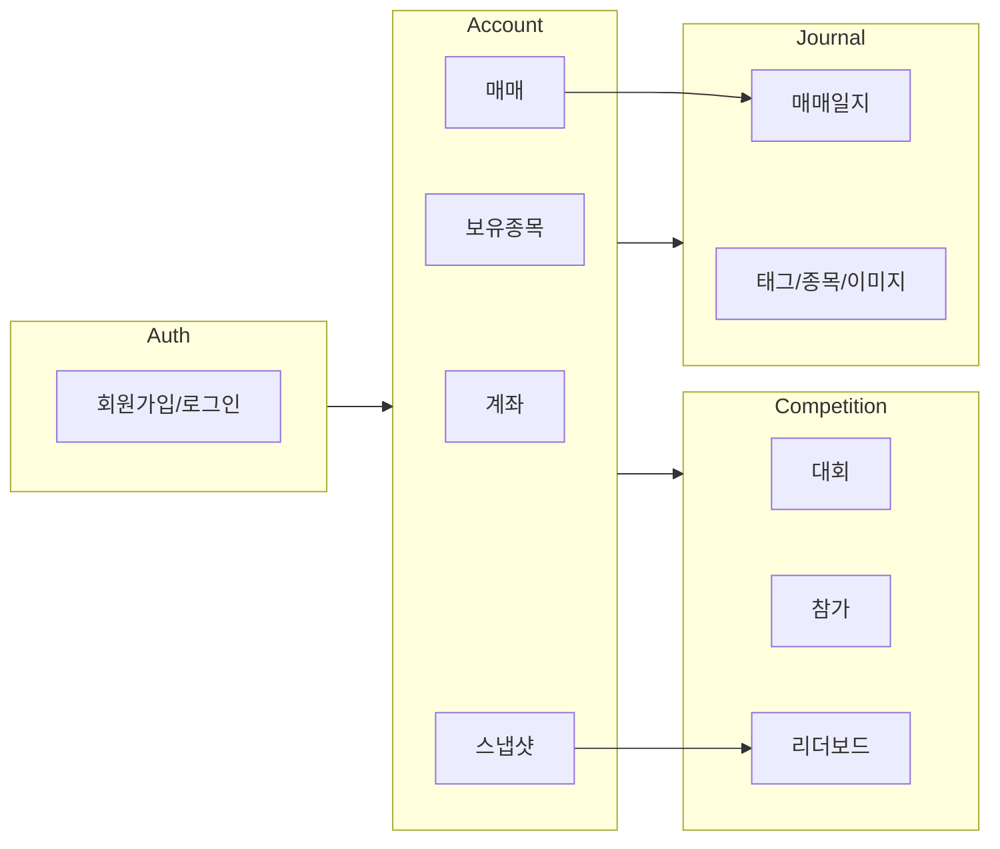
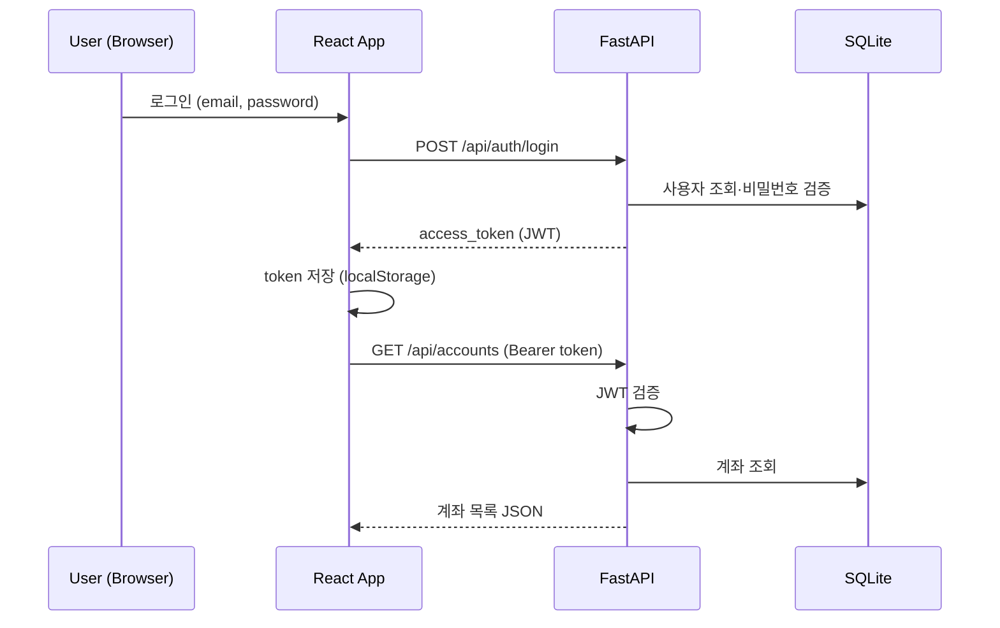

# MANAGESTOCK 전체 프로젝트 가이드 (guide.md)

## 1. 문서 안내

본 프로젝트는 아래 4개 문서로 구성된다. **개발을 시작하기 전에 본 가이드를 먼저 읽고**, 역할에 맞는 상세 명세를 참조한다.

| 문서 | 파일 | 대상 | 내용 |
|------|------|------|------|
| **전체 가이드** | `guide.md` | 전체 | 아키텍처, 실행 방법, 개발 흐름, 협업 규칙 |
| **프론트엔드 명세** | [front.md](./front.md) | FE 개발자 | 화면, 라우팅, UI/UX, API 연동 |
| **백엔드 명세** | [backend.md](./backend.md) | BE 개발자 | REST API, 비즈니스 로직, 보안 |
| **DB 설계 명세** | [db.md](./db.md) | BE / DBA | ERD, 테이블, 쿼리, 마이그레이션 |

---

## 2. 프로젝트 개요

### 2.1 프로젝트명
**MANAGESTOCK** — 주식 계좌 관리 · 매매일지 · 수익률 경연 대회

### 2.2 목표
개인 투자자가 다음을 하나의 웹에서 수행할 수 있도록 한다.

1. **계좌 관리** — 여러 증권 계좌 등록, 매매 기록, 보유종목·수익률 추적
2. **매매일지** — 매매 근거·반성·감정 상태를 기록하고 과거 매매와 연결
3. **수익률 경연** — 기간별 대회에 참가하고 다른 사용자와 수익률 순위 경쟁

### 2.3 대상 사용자

| 사용자 | 주요 행동 |
|--------|-----------|
| 일반 투자자 | 계좌·매매·일지 관리, 대회 참가 |
| 관리자 | 경연 대회 생성·수정·참가자 관리 |

### 2.4 MVP 범위

**포함**
- JWT 기반 회원가입·로그인
- 계좌 CRUD, 매수/매도 등록, 보유종목·수익률 산출
- 매매일지 CRUD (Markdown)
- 경연 대회 목록·참가·리더보드
- 관리자 대회 관리

**제외 (추후 확장)**
- 실시간 주가 API 연동
- WebSocket 실시간 리더보드
- OAuth 소셜 로그인
- 모바일 앱

---

## 3. 기술 스택

```
┌─────────────────────────────────────────────────────────┐
│                    Browser (React SPA)                   │
│  React 18 · Vite · TypeScript · TanStack Query          │
│  shadcn/ui · Tailwind CSS · Recharts                    │
└──────────────────────────┬──────────────────────────────┘
                           │ HTTP/REST (JSON)
                           │ Authorization: Bearer JWT
┌──────────────────────────▼──────────────────────────────┐
│                   FastAPI (Python 3.11+)                   │
│  SQLAlchemy 2.0 · Pydantic v2 · Alembic · Uvicorn         │
└──────────────────────────┬──────────────────────────────┘
                           │
┌──────────────────────────▼──────────────────────────────┐
│                    SQLite 3 (MVP)                        │
│              → PostgreSQL (운영 전환 가능)               │
└─────────────────────────────────────────────────────────┘
```

| 레이어 | 기술 | 버전 기준 |
|--------|------|-----------|
| Frontend | React + Vite + TypeScript | React 18+ |
| Backend | FastAPI + SQLAlchemy | FastAPI 0.110+ |
| Database | SQLite | 3.x |
| Auth | JWT (Bearer) | HS256, 24h |

---

## 4. 프로젝트 구조

```
MANAGESTOCK/
├── guide.md              # 본 문서 — 전체 가이드
├── front.md              # 프론트엔드 명세
├── backend.md            # 백엔드 명세
├── db.md                 # DB 설계 명세
├── frontend/             # React 앱 (생성 예정)
│   ├── src/
│   ├── package.json
│   └── .env.example
├── backend/              # FastAPI 앱 (생성 예정)
│   ├── app/
│   ├── alembic/
│   ├── tests/
│   ├── requirements.txt
│   └── .env.example
└── README.md             # 프로젝트 소개·빠른 시작 (생성 예정)
```

---

## 5. 시스템 아키텍처

### 5.1 계층 구조 (백엔드)

```
Router (HTTP)  →  Service (비즈니스 로직)  →  Model/ORM (DB)
     ↑                    ↑
  Schema (Pydantic)   Dependencies (Auth)
```

- **Router:** HTTP 요청/응답, 상태 코드
- **Service:** 수익률 계산, 매매 처리, 대회 순위 산출
- **Model:** SQLAlchemy 테이블 매핑
- **Schema:** 요청·응답 검증

### 5.2 도메인 모듈



### 5.3 인증 흐름



---

## 6. 핵심 비즈니스 규칙

아래 규칙은 FE·BE·DB 전반에서 일관되게 적용한다. 상세 구현은 [backend.md](./backend.md), [db.md](./db.md) 참조.

### 6.1 계좌·매매

| 규칙 | 설명 |
|------|------|
| 초기 현금 | 계좌 생성 시 `cash_balance = initial_capital` |
| 매수 | 현금 차감, 보유종목 수량·평균단가 가중평균 갱신 |
| 매도 | 보유 수량 초과 매도 불가 (400) |
| 평가금액 | `cash_balance + Σ(수량 × 현재가)` |
| 수익률 | `(평가금액 - initial_capital) / initial_capital × 100` |
| 현재가 | MVP는 holdings 테이블 수동 입력 |

### 6.2 경연 대회

| 규칙 | 설명 |
|------|------|
| 참가 자격 | 본인 소유 계좌만 |
| 1인 1계좌 | 동일 대회에 사용자당 1계좌 |
| 기준금액 | 참가 시점 `entry_value` 고정 |
| 대회 수익률 | `(current_value - entry_value) / entry_value × 100` |
| 순위 | `return_rate` 내림차순 |
| 상태 | `upcoming` → `active` → `ended` |

### 6.3 매매일지

| 규칙 | 설명 |
|------|------|
| 소유권 | 작성자만 수정·삭제 |
| 연결 | 선택적으로 계좌·매매·종목 연결 |
| 본문 | Markdown 저장, FE에서 렌더링 |

---

## 7. API 개요

Base URL: `http://localhost:8000/api`

| 그룹 | Prefix | 주요 엔드포인트 |
|------|--------|-----------------|
| 인증 | `/auth` | register, login, me |
| 계좌 | `/accounts` | CRUD, holdings, performance |
| 매매 | `/accounts/{id}/trades` | CRUD |
| 일지 | `/journals` | CRUD, images |
| 대회 | `/competitions` | list, join, leaderboard, chart |
| 대시보드 | `/dashboard` | summary |
| 관리자 | `/admin` | competitions CRUD |

전체 API 명세: [backend.md §4](./backend.md#4-api-엔드포인트-명세)  
Swagger UI: `http://localhost:8000/docs` (백엔드 실행 후)

---

## 8. 화면·라우트 개요

| 경로 | 화면 | Phase |
|------|------|-------|
| `/login`, `/register` | 인증 | P0 |
| `/dashboard` | 통합 요약 | P1 |
| `/accounts`, `/accounts/:id` | 계좌 관리 | P0 |
| `/journal` | 매매일지 | P1 |
| `/competitions`, `/competitions/:id` | 경연 대회 | P2 |
| `/profile` | 프로필 | P1 |
| `/admin/competitions` | 관리자 | P3 |

전체 Sitemap: [front.md §3](./front.md#3-화면-구성-sitemap)

---

## 9. 개발 환경 설정

### 9.0 원클릭 실행 (권장)

```bash
npm start
```

또는 Windows에서 `start.bat` 더블클릭

자동 실행 항목:
1. 백엔드 venv 생성 + pip install
2. 프론트엔드 npm install
3. `.env` 파일 생성
4. 백엔드 + 프론트엔드 동시 실행
5. 브라우저 자동 열기

종료: `Ctrl + C`

### 9.1 사전 요구사항

| 도구 | 버전 |
|------|------|
| Node.js | 20 LTS 이상 |
| npm 또는 pnpm | 최신 |
| Python | 3.11 이상 |
| Git | 2.x |

### 9.2 백엔드 실행

```bash
cd backend
python -m venv venv

# Windows
venv\Scripts\activate

# macOS / Linux
source venv/bin/activate

pip install -r requirements.txt

# .env 파일 생성 (backend/.env.example 참고)
# SECRET_KEY는 반드시 랜덤 문자열로 설정

alembic upgrade head
uvicorn app.main:app --reload --port 8000
```

확인: `http://localhost:8000/health` → `{ "status": "ok" }`

### 9.3 프론트엔드 실행

```bash
cd frontend
npm install

# .env 파일 생성
# VITE_API_URL=http://localhost:8000

npm run dev
```

확인: `http://localhost:5173`

### 9.4 환경 변수 요약

**backend/.env**
```env
DATABASE_URL=sqlite:///./managestock.db
SECRET_KEY=your-random-secret-key-here
ALGORITHM=HS256
ACCESS_TOKEN_EXPIRE_MINUTES=1440
CORS_ORIGINS=http://localhost:5173
UPLOAD_DIR=./uploads
```

**frontend/.env**
```env
VITE_API_URL=http://localhost:8000
VITE_APP_NAME=MANAGESTOCK
```

---

## 10. 개발 로드맵

### Phase 0 — 기반 (1~2주)

| 작업 | 담당 | 산출물 |
|------|------|--------|
| 프로젝트 스캐폴딩 | FE + BE | `frontend/`, `backend/` |
| DB 마이그레이션 | BE | Alembic 001~005 |
| 인증 API | BE | `/auth/*` |
| 인증 UI | FE | login, register |
| 계좌·매매 API | BE | accounts, trades |
| 계좌·매매 UI | FE | accounts, trades |

**완료 기준:** 회원가입 → 로그인 → 계좌 생성 → 매수/매도 등록 → 수익률 표시

### Phase 1 — 일지·대시보드 (1주)

| 작업 | 담당 |
|------|------|
| journals API + DB | BE |
| dashboard summary API | BE |
| account_snapshots | BE |
| 매매일지 UI | FE |
| 대시보드 UI | FE |
| 프로필 UI | FE |

### Phase 2 — 경연 대회 (1주)

| 작업 | 담당 |
|------|------|
| competitions API | BE |
| join / leaderboard / chart | BE |
| competition_snapshots | BE |
| 대회 목록·상세·리더보드 UI | FE |

### Phase 3 — 관리·고도화 (1주)

| 작업 | 담당 |
|------|------|
| admin competitions API | BE |
| 대회 상태 스케줄러 | BE |
| 이미지 업로드 | BE + FE |
| 관리자 UI | FE |
| 테스트·버그 수정 | FE + BE |

---

## 11. 개발 워크플로우

### 11.1 기능 추가 순서 (권장)

1. [db.md](./db.md) — 테이블·관계 확인 또는 Alembic 마이그레이션 추가
2. [backend.md](./backend.md) — Schema → Service → Router 구현
3. Swagger(`/docs`)에서 API 수동 테스트
4. [front.md](./front.md) — types → api 함수 → page/component
5. FE ↔ BE 통합 테스트

### 11.2 브랜치 전략 (권장)

```
main          ← 안정 버전
└── develop   ← 통합 개발
    ├── feature/auth
    ├── feature/accounts
    ├── feature/journals
    └── feature/competitions
```

- `feature/*` → `develop` PR
- Phase 완료 후 `develop` → `main` merge

### 11.3 커밋 메시지 (권장)

```
feat: 계좌 목록 API 추가
fix: 매도 시 보유 수량 검증 오류 수정
docs: guide.md 개발 환경 섹션 보완
refactor: trade_service 평균단가 계산 분리
test: competition 리더보드 순위 테스트
```

---

## 12. 코딩 Convention

### 12.1 공통

| 항목 | 규칙 |
|------|------|
| API 경로 | kebab-case, 복수형 (`/accounts`, `/competitions`) |
| JSON 필드 | snake_case (`return_rate`, `stock_code`) |
| 날짜/시간 | UTC 저장, ISO 8601 응답 |
| 금액 표시 (FE) | `₩1,234,567`, 소수 2자리 |
| 수익률 표시 (FE) | `+12.34%` / `-5.67%`, 색상 구분 |

### 12.2 프론트엔드

| 항목 | 규칙 |
|------|------|
| 파일명 | PascalCase (컴포넌트), camelCase (utils, hooks) |
| 컴포넌트 | 기능별 `components/features/` 분리 |
| API | `src/api/` 모듈별 분리 |
| Query Key | `['domain', id?, sub?]` |

### 12.3 백엔드

| 항목 | 규칙 |
|------|------|
| Router | HTTP만 담당, 로직은 Service |
| Service | 트랜잭션·비즈니스 규칙 |
| 예외 | HTTPException + 명확한 detail 메시지 |
| 테스트 | `tests/` — pytest, in-memory SQLite |

---

## 13. 데이터베이스

- **테이블 수:** 13개 ([db.md §10](./db.md#10-테이블-수-요약))
- **핵심 관계:** `users` → `accounts` → `holdings` / `trades`
- **마이그레이션:** Alembic (`alembic upgrade head`)
- **시드:** 관리자 계정, 샘플 대회 ([db.md §5](./db.md#5-초기-시드-데이터))

### ER 요약

```
users ──┬── accounts ──┬── holdings
        │              ├── trades
        │              ├── account_snapshots
        │              └── competition_entries ── competitions
        └── journals ──┬── journal_tags
                       ├── journal_stocks
                       ├── journal_trades → trades
                       └── journal_images
```

---

## 14. 테스트

### 14.1 백엔드

```bash
cd backend
pytest -v
pytest --cov=app --cov-report=term-missing
```

**필수 테스트 시나리오**
- 회원가입·로그인·토큰 만료
- 계좌 CRUD + 타 사용자 접근 403
- 매수 → 보유종목 갱신
- 매도 수량 초과 → 400
- 대회 참가 + 리더보드 순위

### 14.2 프론트엔드

```bash
cd frontend
npm run test        # Vitest
npm run test:e2e    # Playwright (선택)
```

### 14.3 수동 통합 테스트 체크리스트

- [ ] 회원가입 → 자동/수동 로그인
- [ ] 계좌 생성 (초기자본 1,000만)
- [ ] 삼성전자 10주 매수
- [ ] 현재가 수정 → 수익률 변경 확인
- [ ] 매매일지 작성 + 매매 연결
- [ ] 대회 참가 → 리더보드 내 순위 표시
- [ ] 로그아웃 → 보호 라우트 접근 차단

---

## 15. 보안 체크리스트

- [ ] `SECRET_KEY` .env에만 저장, Git 미포함
- [ ] `.env`, `*.db`, `uploads/` → `.gitignore`
- [ ] 비밀번호 bcrypt 해싱
- [ ] 모든 보호 API JWT 검증
- [ ] 리소스 `user_id` 소유권 검증
- [ ] 파일 업로드 확장자·크기 제한
- [ ] CORS Origin 화이트리스트

---

## 16. 배포 (참고)

MVP 이후 운영 배포 시 권장 구성:

| 구성요소 | 권장 |
|----------|------|
| Frontend | Vercel / Netlify / Nginx static |
| Backend | Docker + Uvicorn / Gunicorn |
| Database | PostgreSQL (SQLite → 전환) |
| 파일 저장 | S3 또는 로컬 volume |
| HTTPS | Reverse proxy (Nginx, Caddy) |

환경 변수는 배포 플랫폼 시크릿으로 관리한다.

---

## 17. 트러블슈팅

| 증상 | 원인 | 해결 |
|----------|------|------|
| CORS 오류 | Origin 미등록 | `CORS_ORIGINS`에 FE URL 추가 |
| 401 Unauthorized | 토큰 만료/누락 | 재로그인, Axios interceptor 확인 |
| SQLite locked | 동시 쓰기 | WAL 모드, connection pool 조정 |
| FE API 연결 실패 | URL 불일치 | `VITE_API_URL` 확인 |
| Alembic 충돌 | 마이그레이션 불일치 | `alembic history`, head 통일 |
| 수익률 0% 고정 | current_price 미입력 | holdings 현재가 업데이트 |

---

## 18. 용어 사전

| 용어 | 설명 |
|------|------|
| initial_capital | 계좌 최초 투입 자본 |
| cash_balance | 현재 현금 잔고 |
| avg_price | 보유종목 평균 매입단가 |
| return_rate | 수익률 (%) |
| entry_value | 대회 참가 시점 평가금액 (기준) |
| realized_pnl | 매도 실현손익 |
| snapshot | 특정 일자의 계좌/대회 상태 기록 |

---

## 19. 문서 변경 이력

| 날짜 | 버전 | 변경 내용 |
|------|------|-----------|
| 2026-05-31 | 1.0.0 | 초기 작성 — guide, front, backend, db 명세 |

---

## 20. 빠른 참조 링크

- 프론트엔드 상세: [front.md](./front.md)
- 백엔드 API 상세: [backend.md](./backend.md)
- DB 스키마 상세: [db.md](./db.md)
- API 문서 (로컬): http://localhost:8000/docs
- 프론트 (로컬): http://localhost:5173
